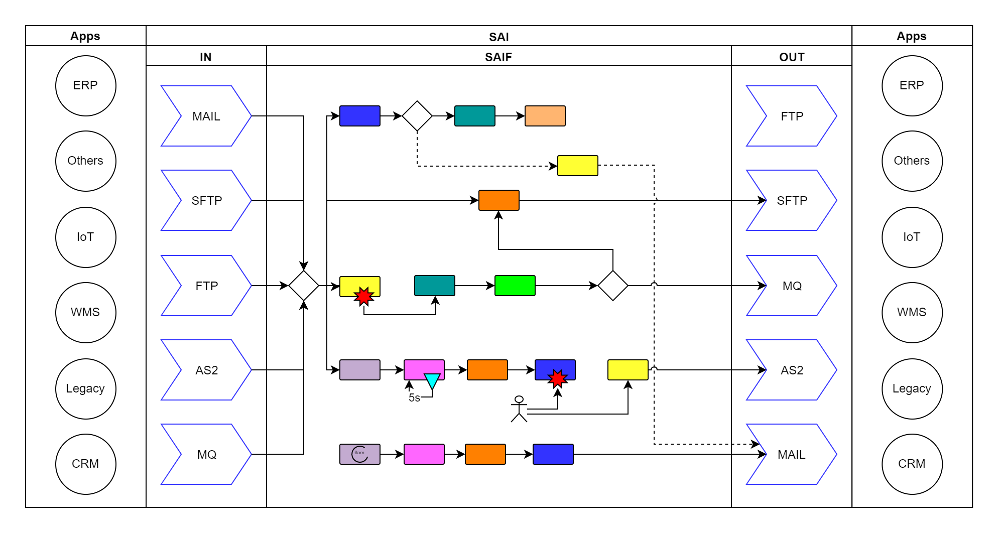

# Business Model

# Vulgarisation de SAI

Depuis les années 1990, l'informatique n'a fait qu'évoluer et prendre de plus en plus de place dans nos vie.
On peut compter aujourd'hui 7000 Langues dans le monde alors qu'il existe pas loin de 9000 langages de programation.
Aujourd'hui à l'heure du tout digital et du cloud, là où l'informatique devait nous aider finalement nous contraints.

Elle nous contraint à communiquer avec des outils toujours plus complexes et diversifiés.
Elle nous contraint à respecter des normes précises pour que notre interlocuteur puisse nous comprendre mais parfois incompréhensible pour nous.

Quotidiennement nous faisons des actions manuelles qui nous semblent anodine et logique:
- Analyser (une facture refusée, un mauvais article envoyé, un bon de réduction invalide, une erreur de prix)
- Rapporter (par email, sur un cloud comme Sharepoint ou Google)
- Corriger (générer la nouvelle facture ou publier le nouveau prix chez les partenaires)
L'Humain n'étant pas exampt de défaut, le facteur Humain dans l'informatique est:
- Consommateur de temps car nous seront toujours plus lent qu'un ordinateur
- Générateur d'erreur car "l'erreur est humaine" et notre mémoire n'est pas infaible
- Limitant car nous ne sommes pas multitâche

L'automatisation de notre travail permet donc de:
- Standardiser et vérifier, le programme fera toujours ce dont pour quoi il a été conçu et toujours de la même façon
- Capitaliser, une erreur découverte n'existera plus jamais une fois chargée dans le programme
- Un volume de traitement plus important car même nos téléphones sont plus performant que nous
- Une surveillance accrue car nous seront alerté au moindre problème

SAI, c'est un peu comme un téléphone sorti en 2007 qui passait un peu pour un OVNI aux yeux de tous.
Il était difficile de savoir à quoi il pourrait bien servir jusqu'à ce qu'on s'en serve et le découvre.

# Que sait faire SAI?

## Cas N°1: Excel mon beau excel!

Vous recevez de multiple client, des factures toutes dans un format différent:
- Les dates sont reçu au format "31/12/2022" ou "31-12-22"
- Les sommes ont un séparateur de milier, les décimales sont séparées parfois par une virgule, parfois par un point
- Les sommes, la référence de l'article ou encore sa quantité ne sont pas dans la même colonne
Afin de déclarer ces factures en interne, elles doivent être normée dans un fichier excel pour être important dans un logiciel de facturation.
Ce cas est extremement consomateur de temps et générateur d'erreur car un prix pourrait être confondu avec une référence par exemple.
En cas d'erreur, sa détection est parfois tardive et son impact grossi en fonction.

SAI dans ce cas permet de:
- Définir votre traitement en fonction du client
- Transformer le fichier reçu dans le fichier excel au format souhaité
- Définir des calculs complexe et aller rechercher des informations provenant d'un autre système (SAP)
- Envoyer ce fichier à plusieurs destinataires (une équipe par email ou un logiciel tiers comme SAP directement)
- Alerter en cas d'erreur d'autres destinataires (le client source, une personne en particulier)
- Relancer le traitement une heure plus tard à cause d'un facteur externe
- Traiter les fichiers à une heure ou date donné
- Conserver les fichiers en cas d'arrêt du système en attendant de les traiter

## Cas n°2: Budget, je te couperai

Les employés utilisent un logiciel de pointage qui permet ensuite de calculer les budgets en fonction des projets pointés.
Ces employés travaillent parfois sur plusieurs projets en même temps et le pointage qui en découle est complexe.
Les projets sont défini par ordre de priroité et forcent le découpage des heures par exemple:
- Sur une journée de 8h
- Le projet B est prioritaire
- L'employé point de 8h à 12h sur le projet A et de 14h à 18h sur le projet C
- Cependant pendant cette journée, il passe aussi 2 fois 1h sur le projet B
On se retrouve donc avec un chevauchement des heures projets, une découpe est nécessaire afin d'obtenir:
- Projet A de 10h à 12h
- Projet C de 14h à 18h
- Projet B de 8h à 10h
Ce genre d'opération se complexifie en fonction du nombre d'employés et de projet et peut vite être source d'erreur.

SAI dans ce cas permet de:
- S'assurer que le calcul est bien fait
- Changer dynamiquement les priorités projets et impacter automatiquement les calculs
- Gagner du temps (si les projets sont des absences ou des maladies, cela devient bénéfique pour la génération de la paye)

## Cas n°3: Le coupe-fil

Parfois un traitement est priroitaire car c'est une erreur grave ou un client VIP.
Si la demande est reçu par email, elle peut passer inaperçu un certain temps.

SAI dans ce cas permet de:
- Définir une priorité en fonction de conditions comme l'emmeteur ou des données dans le fichiers

## Cas n°4: Je connais la chanson

Le BlackFriday approche et je dois préparer, comme chaque année, la mise à jours des prix et les promotions qui seront appliquées pendant cette période.
Je sais que chaque année, j'ai des erreurs de prix qui sont commises, plus ou moins grave car l'action finale est manuelle.
Le problème est que lorsque ces erreurs de prix arrivent, les commandes sont envoyées si rapidement qu'entre l'alerte et la correction, certaines ont déjà été envoyés et ne sont donc plus annulable. C'est une perte de bénéfice.

SAI dans ce cas permet de:
- Automatiser l'action finale et les vérifications qui en découlent
- Automatiser l'analyse de commande et la validation du prix final avant son envoie
- Alerter en temps réel sans impacter les temps de commande.
