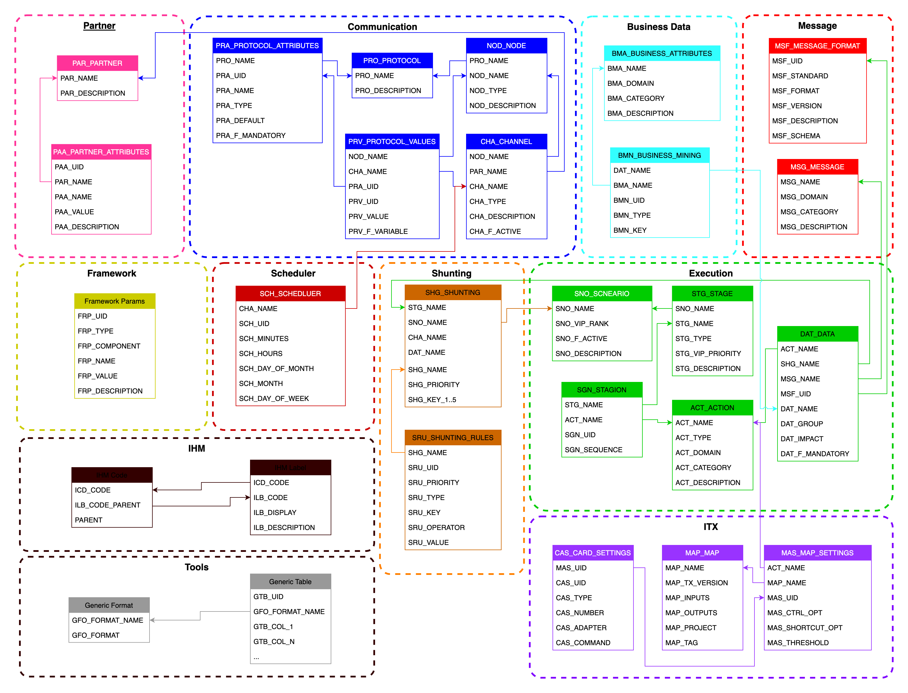

# Data Model

## Presentation

Le Data Model de SAI représente un modèle relationel des fondations de **SAI** sans lien précis avec une base de données comme Oracle, MySQL, Sybase ou autre.

Chaque zone représente un compmosant ou une fonctionnalité qui sera ensuite décrite dans des spéficitations détaillées.

Une seule zone est propre à l'outil Transformation eXtender, liée indirectement à la partie Processing, c'est la zone ITX.
Cependant cette zone étant indépendante, le Processing a été pensé de façon à pouvoir ratacher toute nouvelle zone en fonction de nouveau logiciel.
