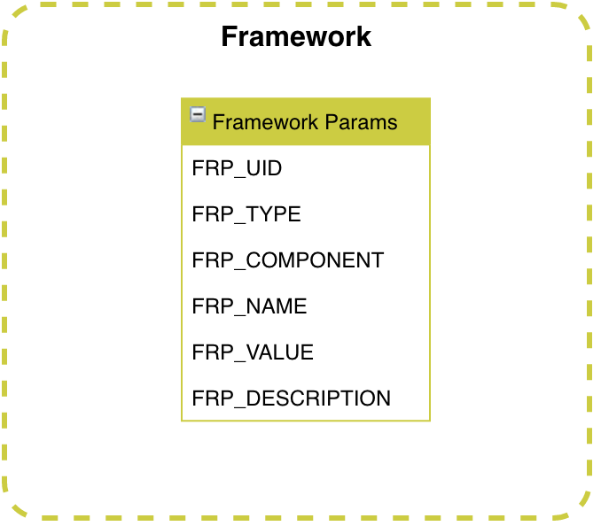

# Framework #

## Introduction

C'est une section sans lien physique avec les autres tables. Le but est de fournir assez de paramètres au framework pour ne pas avoir à effectuer de nouvelle livraison mais simplement un changement de setup.

## Framework Params
Partie dédiée à l'équipe Framework qui permettra de jouer avec des paramètres plus ou moins fin de chacun des composants framework. Par exemple, l'activation de log en cas d'incident.
