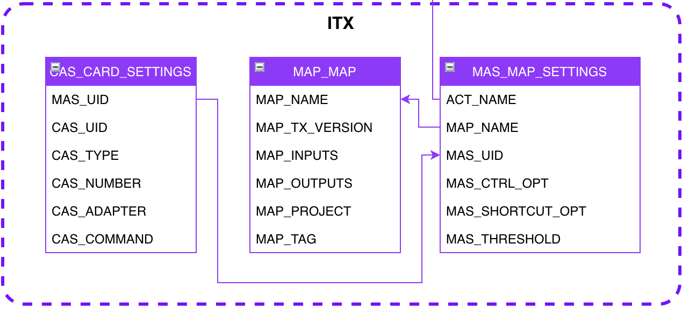

# ITX #

## Introduction

Le section __ITX__ est séparée du reste du modèle. C'est une section qui permettra la __configuration de map__ séparément du contexte d'une activité. Le but étant de ne pas garder un __modèle fermé à l'exécution de process ITX__.
C'est une partie qui nécessitera une __expertise ITX__ pour le bon setup et une __documentation du framework__ afin de garantir la compréhension de certaines clés/fonctionnalités offertes par le framework.

## Map
Ici c'est la base de ITX. Ceci représente une map physiquement présente sur le serveur avec donc son nom qui se doit d'être unique.
Le projet et la branch ont pour but de faciliter le support en cas de besoin et la version peut correspondre à un compilé précis.
Il faut faire attention ici au fait qu'il est difficile de retrouver une source à partir d'un compilé, une bonne organisation est de rigueur pour garantir un support maximum.
Le nombre d'input et d'output sont des variables à renseigner automatiquement par une industrialisation et doivent être utilisées par l'IHM afin de forcer le setup de toutes les cartes.

## Map Settings
Ce sont ici des settings globaux à la map, l'audit log, le data audit, l'activation des traces DB (nécessitant des bonnes pratiques de code).
Le threshold permet de définir des options implicit (à voir si nous devons les passer en explicit) et dépend de la taille de l'entrée de la map. Par exemple, si celle-ci dépasse le threshold, alors le workspace de la map sera en mode fichier sinon mémoire.
Il peut être interessant de réfléchir à avoir des options comme PageSize et PageCount qui dépendent eux aussi de la taille de l'entrée.

## CardOptions
C'est ici que le setup final de la map et de chacune de ses carte sera défini.
Il faut penser IHM, d'abord pour les adapters où des Label/Value seront mis en place mais aussi pour les commandes où un Wizard pourrait être mis en place car chaque adapteur à ses propres commandes.
