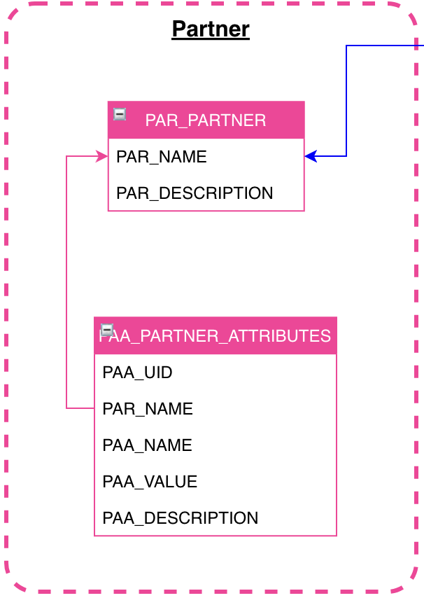

# Partner #

## Introduction

La section Partner reste optionnelle et permettra une meilleur visibilité et suivi dans le monitoring de SSB.

Il est possible que ça ne soit pas nécessaire dans des versions light de SSB car celui-ci ne ferai qu’une seule tâche.

## Partner
Cette table représente le Partner en lui même avec son nom.

## Partner Attribute
Dans un but uniquement fonctionnel, cette table permettra de fournir des attributs sous forme de clé/valeur afin de garder une ouverture de SSB maximale.
