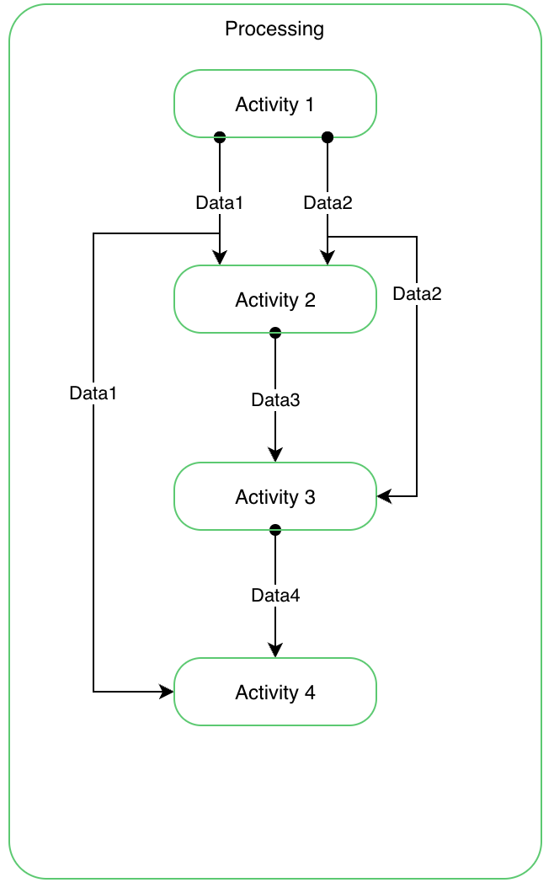

# Function 1

## Présentation

Il est ici question d'une fonctionalité assez inédite n'existant pas encore.
Il faut tout d'abord noter que chaque sortie d'une action a un nom unique.
>**Note**: ce nom unique l'est dans tout le modèle et pas seulement pour le contexte de l'action, le stage ou le scenario.

Il est ensuite assez facilement compréhensible que chaque sortie peut-être renvoyée à une autre action un peu plus loin dans le process, ceci grâce uniquement à l'unicité du nom de chaque sortie.
