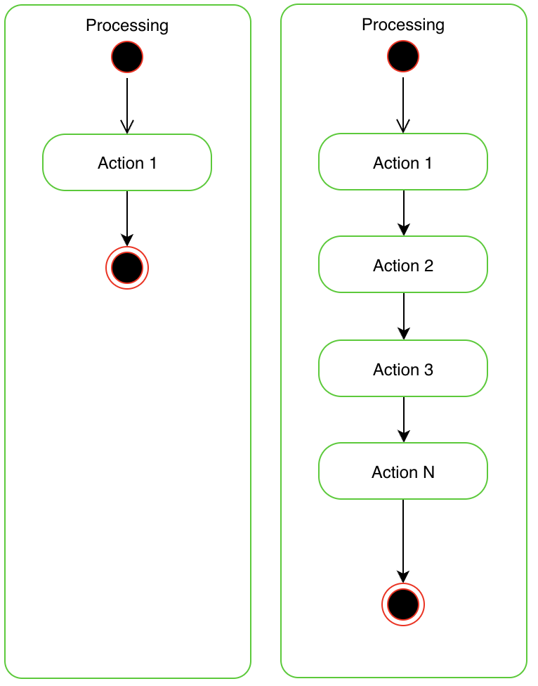
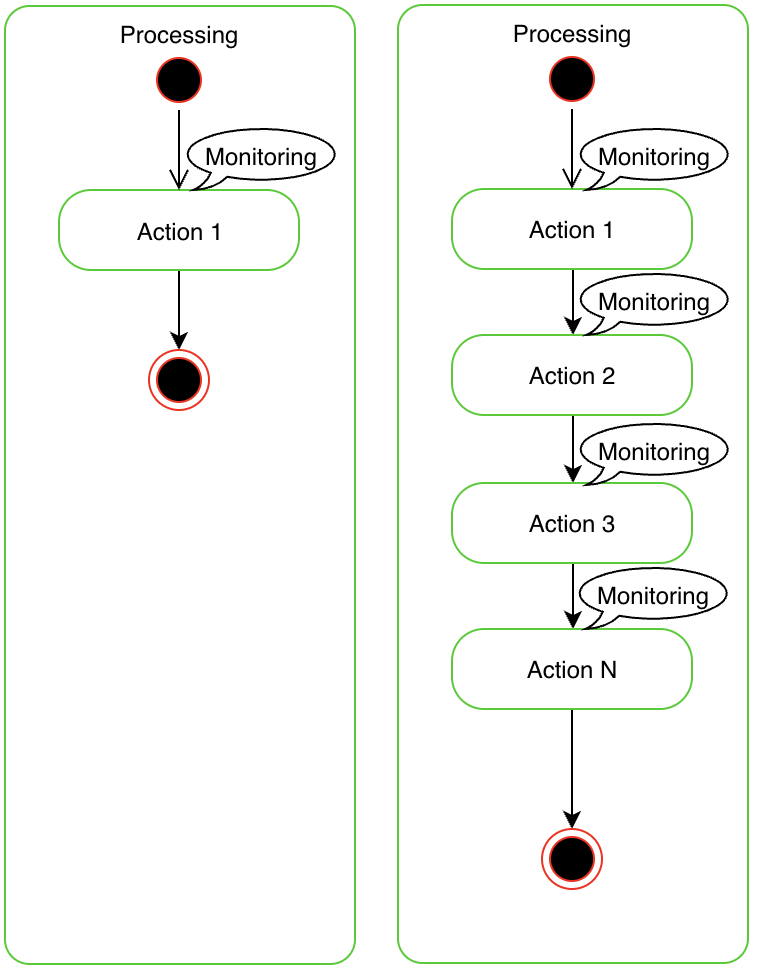

# MIACT

## Présentation

Vous l'avez compris, la fonction primaire du Processing est de pouvoir executer une ou plusieurs actions à la suite.
C'est à première vue une fonctionalité basique et simple mais qui induit des sous fonctionalités importante.

## Error Handling

En cas d'erreur sur une activité lors de son execution, il est important de savoir quel choix devra être fait:
1. Je continue le flux
2. J'arrête le flux
Si l'on continue, il faudra s'assurer que c'est effectivement possible.
En cas d'arrêt, il faut monitorer tout ce qui est disponible.

## Monitoring

Ici une des pièces maitresse de **SAI** car l'execution d'une ou plusieurs activités peut se faire sur un ou plusieurs thread dépendamment de la puissance souhaitée et du logiciel du framework.
Dans le cas de **SAIF** (Satisc Application Integration Framework), un thread de Processing correspondra à une ou plusieurs actions dans un seul et même stage. Ceci ayant pour but de garantir un bon équilibre entre performances/maintenance.
>**Attention**: il a été volontairement choisi de ne pas executer plusieurs Stage dans un seul Processing à cause de la complexité du code et donc de sa maintenance avec le produit ITX. Ceci ne l'exclus pas cette possibilité avec un autre logiciel.

La problématique de **SAIF** est qu'il est difficile de suivre une execution en détail car les outils de base de ITX sont limités. L'idée est de réussir à faire du monitoring en temps réel.
Pour cela, il faudra trouver un adapteur capable d'envoyer l'événement de monitoring avant même que le Processing soit fini et donc à chaque fin d'activité.
Il sera ainsi possible de tracer une possible execution trop longue ou tombée sans erreur critique.
>**Note**: La piste de l'utilisation de l'adapteur socket ITX est à creuser.

## Test Parts

Le pentagramme de cette fonctionalité est "MIACT".
