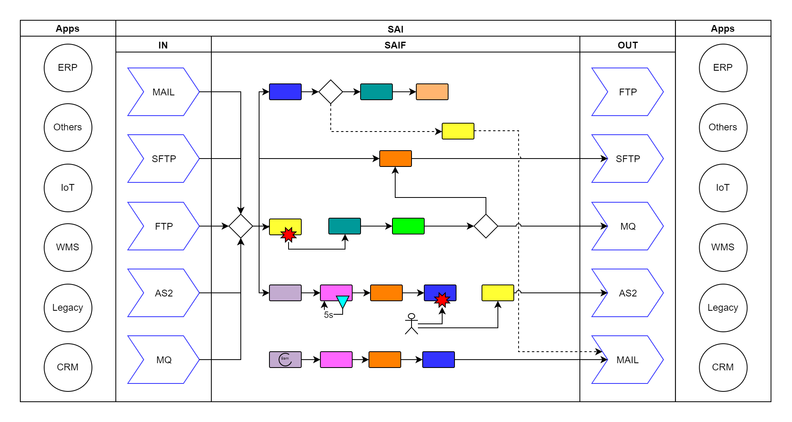

# Operational

# Vulgarisation de SAI

Depuis les années 1990, l'informatique n'a fait qu'évoluer et prendre de plus en plus de place dans nos vie.
On peut compter aujourd'hui 7000 Langues dans le monde alors qu'il existe pas loin de 9000 langages de programmation.
Aujourd'hui à l'heure du tout digital et du cloud, là où l'informatique devait nous aider finalement nous contraint.

Elle nous contraint à communiquer avec des outils toujours plus complexes et diversifiés.
Elle nous contraint à respecter des normes précises pour que notre interlocuteur puisse nous comprendre mais parfois incompréhensibles pour nous.

Quotidiennement nous faisons des actions manuelles qui nous semblent anodines et logiques:
- Analyser (une facture refusée, un mauvais article envoyé, un bon de réduction invalide, une erreur de prix)
- Rapporter (par email, sur un cloud comme Sharepoint ou Google)
- Corriger (générer la nouvelle facture ou publier le nouveau prix chez les partenaires)
L'Humain n'étant pas exampt de défaut, le facteur Humain dans l'informatique est:
- Consommateur de temps car nous serons toujours plus lents qu'un ordinateur.
- Générateur d'erreur car "l'erreur est humaine" et notre mémoire n'est pas infaillible.
- Limitant car nous ne sommes pas multitâches.

L'automatisation de notre travail permet donc de:
- Standardiser et vérifier, le programme fera toujours ce pour quoi il a été conçu et toujours de la même façon.
- Capitaliser, une erreur découverte n'existera plus jamais une fois corrigée dans le programme.
- Un volume de traitement plus important car même nos téléphones sont plus performants que nous.
- Une surveillance accrue car nous seront alertés au moindre problème.

SAI, c'est un peu comme un téléphone sorti en 2007 qui passait un peu pour un OVNI aux yeux de tous.
Il était difficile de savoir à quoi il pourrait bien servir jusqu'à ce qu'on s'en serve et le découvre.
