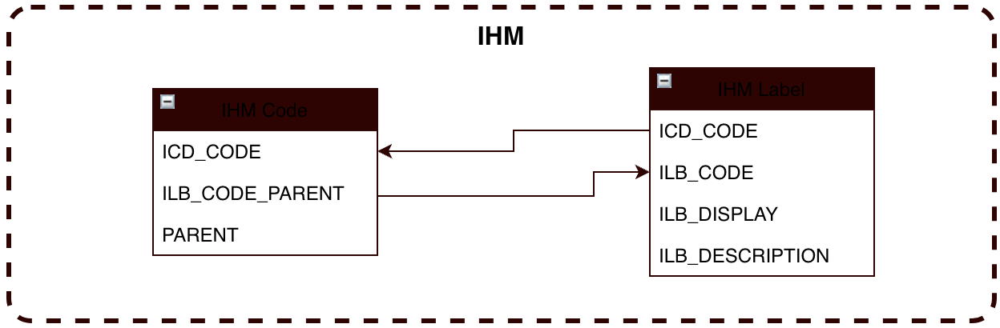

# IHM #

## Introduction

## Generic Code et Details
Ces deux tables sont présente uniquement pour apporter l'aspect Label/Value de l'interface IHM. Ce sont ces tables qui vont permettre à l'équipe Framework de garder les mêmes standard tout au long de l'évolution de SSB et à l'équipe "flux" de comprendre plus facilement chaque option.
Par exemple, pour un client comme ..., la SHUNTER_KEY_1 serait labelisée comme "CONTROL NUMBER" mais pour l'équipe framework resterait qu'une simple clé à comparer.
