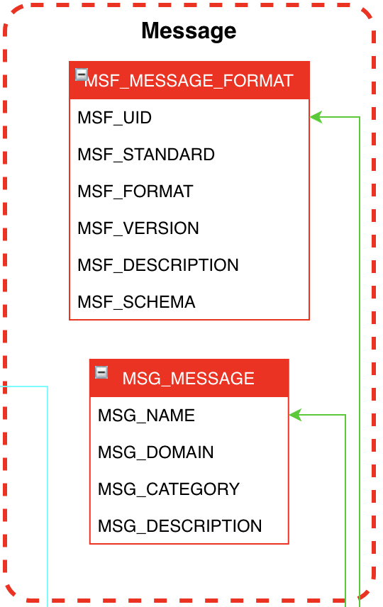

# Message #

## Introduction

La section Message reste optionnelle et permettra une meilleur visibilité et suivi dans le monitoring de SSB.
Il est possible que ça ne soit pas nécessaire dans des versions light de SSB car celui-ci ne ferai qu’une seule tâche.

## Message
Ici on parle d'un message fonctionnel qui se doit de n'avoir aucun lien avec le message technique.
Par exemple, nous ne parlerons pas d'un IFTMBF mais d'un Booking Request.
Le but est de pouvoir lier plusieurs messages techniques à un seul message fonctionnel.

Il se peut aussi que des disparités et spécificités soient présente en fonction des clients.
Chez ..., des messages de type IFTMIN (Shipping Instruction) sont en fait des Booking Request un peu spéciales.

## Domain
Cette table est optionnelle et dépendra des clients. Le nom Domaine n'est possiblement pas le meilleurs mais le but est de catégoriser les messages par Domaine fonctionnels du client.

Par exemple à la ..., les domaines Facturation, ECommerce ou encore Logistic sont représentés.

## Format
Ici c'est la représentation d'un format technique d'un message. Plusieurs normes mondiales sont disponible.
Par exemple rien que dans le domaine de l'EDI, les standards principaux sont EDIFACT et X12 et eux même contient plusieurs sous standard par année puis par type de messages.
Le domaine bancaire se trouve manifestement dans la même configuration.
