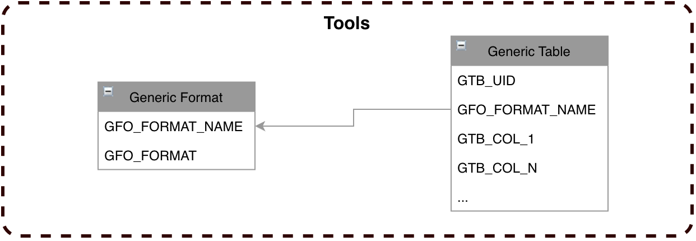

# Tools #

## Introduction

## Transform Format et Code
Le but de ces tables est de mettre à disposition de possible table de transco ou de paramètres pour les flux business.
Un format sera défini par exemple en JSON et affichera via l'IHM l'équivalent d'une vue database. Le développeur pensera coder une table alors qu'en fait ça sera la table de code.
La table de code pourrai contenir beaucoup de colonne anonymisées "colonne_1...". Il faut bien prévoir les colonnes indexées au risque de perdre des performances de recherche.
